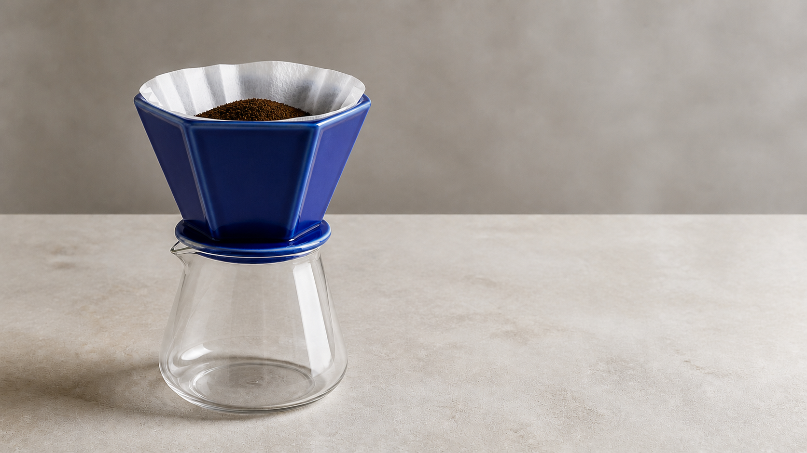
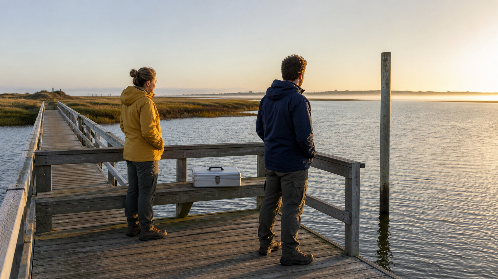

<p align="center">
  <a href="https://bestimage.ai/"></a>
</p>

# Awesome Seedance 2.5 Prompts

**120 video creation briefs, with timed actions, explicit reference roles, sound direction, and continuity checks.** Curated, adapted, and maintained by the **[bestimage.ai team](https://bestimage.ai/)**.

[](prompts/README.md)
[](https://bestimage.ai/models/bytedance/seedance-2-5-text-to-video/)
[](https://bestimage.ai/models/openai/gpt-image-2/)
[](CONTRIBUTING.md)
[](LICENSE)

[English](README.md) · [简体中文](README_ZH.md) · [日本語](README_JA.md) · [Español](README_ES.md) · [Français](README_FR.md) · [Deutsch](README_DE.md) · [한국어](README_KO.md) · [Português](README_PT.md) · [Italiano](README_IT.md) · [15-language coverage](prompts/i18n/README.md)


*Static concept frame for scene 101, created with Codex ImageGen. It is not a Seedance video output. Generation briefs and limitations are recorded in [image notes](assets/IMAGE_PROMPTS.md).*

This library covers product videos, ecommerce, creator content, education, architecture, sound-led storytelling, animation, reference control, and editing briefs. Exact text, physical motion, identity, timing, and audio synchronization must be checked in actual outputs.

## Find a useful starting point

| Your task | Start here |
| --- | --- |
| A narrative, product, UGC, animation, or camera-control scene | [01–24: Chinese foundation library](prompts/prompt-library.md) |
| Commercial, UI, education, architecture, mobility, or public-service content | [25–60: Chinese extended library](prompts/extended-scenarios.md) |
| App flows, creator lessons, product assembly, gallery work, and game concepts | [61–72: English professional workflows](prompts/advanced-workflows.en.md) |
| Match cuts, one-takes, reference boards, local edits, extension, and previs | [73–100: English creative techniques](prompts/creative-techniques.en.md) |
| Twenty additional briefs for collections, product demos, teaching, and production | [101–120: English](prompts/production-workflows.en.md) / [简体中文](prompts/production-workflows.zh.md) |
| A complete list of titles, modes, and entry links | [120-scene index](prompts/README.md) |
| Six shared scenes in your language | [Language directory](prompts/i18n/README.md) |
| A choice based on available input assets | [Use-case matrix](docs/use-case-matrix.en.md) |
| Better timing, camera, sound, or continuity instructions | [Prompting and troubleshooting guide](docs/prompting-guide.md) |

## Create with bestimage.ai

[bestimage.ai](https://bestimage.ai/) provides image and video model pages for exploring a workflow and reviewing its integration requirements. Choose an entry based on the assets you actually have. The links below open **English pages**.

| Model / purpose | Entry | What to prepare |
| --- | --- | --- |
| Seedance 2.5: a concept or written shot list | [Text-to-Video API](https://bestimage.ai/models/bytedance/seedance-2-5-text-to-video/) | A directing brief with subject, timed actions, camera, and sound |
| Seedance 2.5: animate a first frame | [Image-to-Video API](https://bestimage.ai/models/bytedance/seedance-2-5-image-to-video/) | A required first image; an optional matching end image |
| Seedance 2.5: reference-guided creation | [Reference-to-Video API](https://bestimage.ai/models/bytedance/seedance-2-5-reference-to-video/) | At least one required reference video, with optional images and audio |
| GPT Image 2: prepare static images for a later video workflow | [GPT Image 2 API](https://bestimage.ai/models/openai/gpt-image-2/) | A separate image prompt for a concept frame, character sheet, or storyboard |

**GPT Image 2 is an image workflow, not a Seedance video endpoint.** A generated reference image still needs visual and rights review before use in a video request. An image-only reference board does not satisfy the required video input of bestimage.ai's reference-to-video entry.

Read the [bestimage.ai model and API workflow guide](docs/bestimage-ai-api-guide.md) for input roles, API integration, and the distinction between generation, editing, and extension. The API base URL for bestimage.ai is `https://api.flaq.ai`. Use an API key issued through your bestimage.ai account.

## What the counts mean

- **120 unique scenarios:** 24 foundation + 36 extended + 12 professional + 28 technique + 20 additional briefs.
- **Core language distribution:** 60 Chinese scenarios and 40 English scenarios. The 20 additional scenarios are complete in both English and Simplified Chinese.
- **15-language sample coverage:** six shared scenarios in 14 localized files, alongside their Simplified Chinese catalog versions. This does not mean 120 translated prompts in every language.
- **Five new illustrations:** one cover and four reference/concept images, including one four-panel board. Translations, panels, variants, and chapter runs are not counted as additional unique prompts.
- No reference videos or audio recordings are bundled. An instruction naming `Video 1` or `Audio 1` requires an actual supplied asset.

## What makes these prompts usable?

The [official Seedance 2.5 page](https://seed.bytedance.com/en/seedance2_5) describes longer audiovisual generation, reference control, and editing capabilities. Provider capabilities and a particular service's exposed controls are different: do not assume every edit or extension operation has a matching bestimage.ai endpoint.

A useful brief makes each requested behavior observable:

```text
[Mode] Text-to-video / Image-to-video / Reference-to-video / supported edit operation
[Goal] Audience, purpose, target duration, composition
[References] One explicit role for each supplied image, video, or audio asset
[Invariants] Identity, geometry, object count, layout, light direction
[Timeline] Establish → action → consequence → final frame
[Camera] Start, path, speed, focus, stopping point
[Sound] Dialogue, ambience, Foley, music, synchronization cues
[Review] What must remain unchanged and what makes an output unacceptable
```

A timeline expresses creative intent, not guaranteed frame-accurate execution. Review the result against it before publication.

## Three reference-led starting points

### Ceramic coffee dripper — scene 04



A controlled pour with fixed product geometry, gradual liquid accumulation, restrained sound, and a clean final frame. [Complete English prompt](prompts/i18n/prompt-library.en.md#i18n-01-ceramic-coffee-dripper-one-controlled-pour) · [Chinese catalog](prompts/prompt-library.md#04-陶瓷滤杯的一次注水)

### Felt otter returns a book — scene 10


A tactile animation brief with visible wheel movement, supported lifting, a shelf destination, and a quiet ending. [Complete Chinese prompt](prompts/prompt-library.md#10-毛毡水獭的夜间归书)

### Tide-station handover — scene 01



A restrained narrative based on one case handover, stable spatial relationships, and an intentional final view. [Complete Chinese prompt](prompts/prompt-library.md#01-潮位站的晨间交接)

All three images are new static concept references made with Codex ImageGen, not target-model test outputs. They demonstrate intended composition, not proven temporal consistency. The [microscope board](prompts/creative-techniques.en.md#microscope-reference-board) illustrates separate reference roles for scenes 73, 75, and 100.

## A practical creation sequence

1. Choose a scenario and confirm that your service exposes its required mode.
2. Supply authorized assets and preserve their upload order. A reference may control identity, motion, environment, or sound; specify which.
3. Match the target timeline to the selected duration. For image-to-video, prepare the input image in the intended composition instead of inventing an unsupported aspect-ratio parameter.
4. Test a limited action first, then add camera movement and sound. Change one variable per iteration.
5. Check every frame for geometry, anatomy, readable text, object count, physical contact, and edited-region boundaries. Check audio and extension joins separately.
6. Add exact titles, claims, credits, and localized interface copy in post-production when generation cannot preserve them reliably.

## Contribute a reproducible example

Use the [contribution guide](CONTRIBUTING.md) and the included [prompt-submission template](.github/ISSUE_TEMPLATE/prompt.yml). For a tested prompt submission, include the full prompt, actual provider/model, settings, ordered reference roles, a real output, and iteration notes. Do not submit secrets, unlicensed media, unauthorized likenesses, hidden advertising, or fabricated performance evidence.


Official model resources: [Seedance 2.5](https://seed.bytedance.com/en/seedance2_5) · [Seedance 2.5 — ByteDance](https://seed.bytedance.com/en/blog/one-take-creation-flexible-referencing-introducing-seedance-2-5).

## About bestimage.ai

This prompt library is curated and maintained by the [bestimage.ai](https://bestimage.ai/) team, connecting practical creative workflows with image and video model APIs.

## Earn with the bestimage.ai Affiliate Program

Build tutorials, share prompts, or publish API integrations? Join the [bestimage.ai Affiliate Program](https://bestimage.ai/affiliate-program/) and earn commissions by introducing your audience to bestimage.ai.

- **20%** on a referred user's first valid paid order.
- **10%** on subsequent valid paid orders made within **60 days after that user registers**.

Order eligibility and payouts follow the [current affiliate agreement](https://bestimage.ai/affiliate-agreement/).

## License

[MIT](LICENSE).
