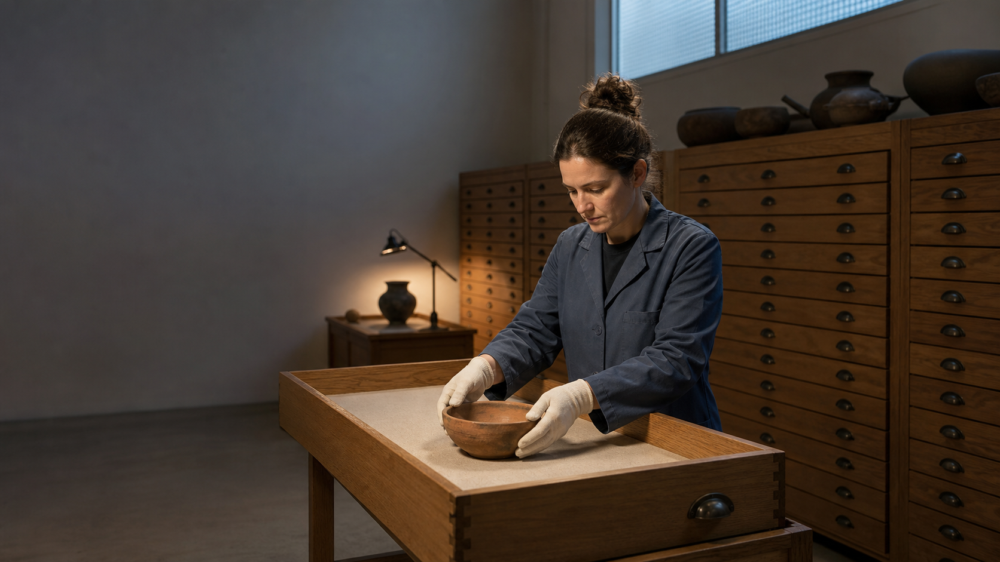

# Seedance 2.5 프롬프트: 한국어 가이드

[English](README.md) · [简体中文](README_ZH.md) · [日本語](README_JA.md) · [Español](README_ES.md) · [15개 언어 전체](prompts/i18n/README.md)



**bestimage.ai 팀**이 정리하고 관리하는 **서로 다른 장면 120개**의 Seedance 2.5 프롬프트 모음입니다. 기존 100개 장면을 다시 작성하고 20개를 추가했습니다. 중국어 기본 카탈로그 60개, 영어 기본 카탈로그 40개, 중국어와 영어로 함께 제공하는 신규 장면 20개로 구성됩니다. 신규 20개의 두 언어 버전은 중복 집계하지 않습니다.

15개 언어 지원은 언어마다 같은 장면 6개를 제공하는 예시 모음입니다. 한국어로 제공하는 것도 이 6개이며, 120개 전체의 한국어 번역이 아닙니다. 수록 이미지는 콘셉트 이미지이며 Seedance로 생성한 영상이나 실제 테스트 결과가 아닙니다.

직접 테스트한 프롬프트를 공유하려면 설정, 입력 자료, 실제 출력물을 준비하고 [기여 가이드](CONTRIBUTING.md)를 참고하세요. 채택한 내용은 검토와 편집 후 기여자 표시와 함께 수록될 수 있습니다.

## 빠른 시작

- 바로 복사할 수 있는 [한국어 전체 프롬프트 6개](prompts/i18n/prompt-library.ko.md)를 확인하세요. 기본 카탈로그의 04, 31, 37, 43, 46, 52번 장면에 해당하며 추가 장면으로 세지 않습니다.
- [120개 장면 인덱스](prompts/README.md)에서 목적에 맞는 예시를 찾으세요. 중국어 60개는 [기본 24개](prompts/prompt-library.md)와 [추가 36개](prompts/extended-scenarios.md), 영어 40개는 [고급 워크플로 12개](prompts/advanced-workflows.en.md)와 [창작 기법 28개](prompts/creative-techniques.en.md)로 나뉩니다.
- 새로 추가한 동일한 장면 20개는 [영어판](prompts/production-workflows.en.md)과 [중국어판](prompts/production-workflows.zh.md)으로 제공됩니다.
- 카메라, 시간 구성, 사운드, 일관성은 [고급 프롬프트 가이드](docs/prompting-guide.md)를 참고하세요.

### bestimage.ai 제작 흐름

아래 모델 페이지는 모두 **영어로 제공**됩니다.

- 텍스트로 시작: [Seedance 2.5 Text-to-Video](https://bestimage.ai/models/bytedance/seedance-2-5-text-to-video/).
- 시작 프레임 한 장으로 시작: [Seedance 2.5 Image-to-Video](https://bestimage.ai/models/bytedance/seedance-2-5-image-to-video/).
- 여러 자료를 참조: [Seedance 2.5 Reference-to-Video](https://bestimage.ai/models/bytedance/seedance-2-5-reference-to-video/). **참조 영상이 최소 한 개 필요**하며, 각 자료가 제어할 요소를 명확히 지정해야 합니다.
- 스토리보드나 시작 프레임 준비: [GPT Image 2 API](https://bestimage.ai/models/openai/gpt-image-2/). 별도의 이미지 생성 워크플로이며, 영상 인터페이스가 아닙니다.

이미지 준비와 영상 생성의 연결은 [bestimage.ai 연동 가이드](docs/bestimage-ai-api-guide.md)를 참고하세요. 설정, 가격, 입력 조건, API 스키마는 변경될 수 있으므로 사용 시 해당 모델 페이지를 확인해야 합니다. 프롬프트에 제시한 시간과 연출은 제작 의도이며, 현재 인터페이스가 그대로 지원하거나 결과가 보장된다는 뜻은 아닙니다.

## 권장 프롬프트 구조

```text
[목표] 사용자, 용도, 길이, 화면비
[참조 역할] 각 이미지나 영상이 담당할 요소를 명확히 지정
[고정 요소] 인물, 제품, 공간, 조명 중 바뀌면 안 되는 항목
[타임라인] 도입 → 행동 → 전환점 → 최종 프레임
[카메라] 숏 크기, 높이, 경로, 속도, 초점, 정지 위치
[사운드] 대사, 환경음, 효과음, 음악, 동기화 지점
[금지] 형태 변화, 중복, 신체 오류, 가짜 글자, 로고, 워터마크
```

각 입력 자료의 역할을 분리하고 실제 출력물에서 형태, 글자, 음성, 물리적 움직임을 확인하세요. 화면을 현지화할 때는 목표 언어로 승인된 화면을 제공하고 영상 모델에 번역을 맡기지 마세요. 콘셉트 이미지나 테스트하지 않은 연출안을 모델 성능의 실증 자료, 부동산의 사실 증명, 제품 안전 인증으로 취급해서는 안 됩니다. 상업적 사용 전 초상권, 이미지·음악 라이선스, 상표, 장소, 안전 표현, 플랫폼 정책을 검토하세요.

## bestimage.ai 소개

이 프롬프트 모음은 [bestimage.ai](https://bestimage.ai/) 팀이 편집하고 관리하며, 실용적인 제작 워크플로를 이미지·영상 모델 API와 연결합니다.

## bestimage.ai 제휴 프로그램으로 수익 얻기

튜토리얼, 프롬프트 또는 API 연동 사례를 공유하시나요? [bestimage.ai 제휴 프로그램](https://bestimage.ai/affiliate-program/)에 참여하여 독자와 시청자에게 bestimage.ai를 소개하고 커미션을 받으세요.

- 추천받은 사용자의 첫 번째 적격 유료 주문에 대해 **20%**.
- 해당 사용자 **등록 후 60일 이내**의 후속 적격 유료 주문에 대해 **10%**.

주문 자격과 정산에는 [현행 제휴 계약](https://bestimage.ai/affiliate-agreement/)이 적용됩니다.

## 라이선스

[MIT](LICENSE).
