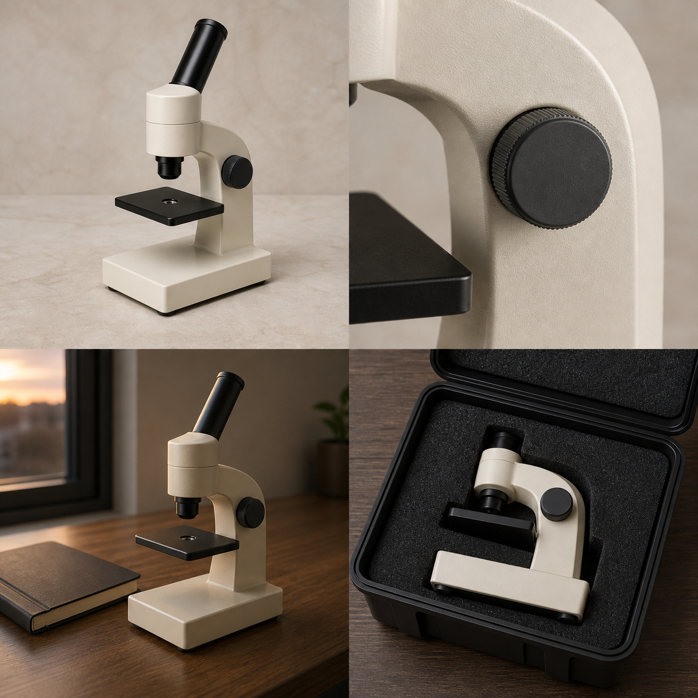

# Seedance 2.5: 28 creative technique briefs

[Home](../README.md) · [120-scene index](README.md) · [Prompting guide](../docs/prompting-guide.md) · [Contribute](../CONTRIBUTING.md)

Scenes **73–100** cover explicit reference roles, editorial timing and reviewable constraints, curated by the bestimage.ai team. Edit and extension instructions require an interface that actually supports those operations; do not assume that ordinary reference generation preserves a source video unchanged.

## Microscope reference board



Static concept art generated with Codex ImageGen, not Seedance output or an engineering drawing. Used by scenes 73, 75, and 100. Separate the four panels into individual inputs before use: Image 1 overall identity; Image 2 focus-knob detail; Image 3 desk environment; Image 4 carrying-case end state. Supply an authorized motion reference separately. The board does not replace the reference video's required input. See [image prompts and limitations](../assets/IMAGE_PROMPTS.md).

## 73. A desktop microscope connected by match cuts

**Mode:** reference-to-video · **Duration:** 24 seconds · **Format:** 16:9

```text
Images 1–4 are the approved microscope board panels: product, focus-knob detail, study desk, carrying case. Video 1 controls only the edit rhythm and matching camera angles. Preserve the same cream body, dark stage, single focus knob, eyepiece, and base across cuts.
00:00–00:06: slow push toward the circular focus knob in Image 1.
00:06–00:12: match its circle and screen position to Image 2; an adult hand turns it slightly without changing its diameter.
00:12–00:18: cut on the hand leaving frame to Image 3's complete desk scene, showing the same microscope already placed there.
00:18–00:24: cut to the packed product in Image 4 and hold; packing happens between shots, not by magically folding the microscope.
Audio: knob movement, one desk contact, soft case fabric, no speech or music. No invented magnification, scientific findings, logos, readable pages, changing parts, or watermark. The scene sells a visual idea, not verified product specifications.
```

## 74. One take through three listening stations

**Mode:** reference-to-video · **Duration:** 30 seconds · **Format:** 16:9

```text
Video 1 is a continuous authorized camera path through three connected rooms. Images 1–3 supply an original sound-exhibition design: rain station, wooden percussion station, and quiet listening bench. Preserve doors, room order, walking distance, and eye-level perspective.
00:00–00:08: enter the rain station with one adult visitor ahead, hearing a gentle supplied rain recording.
00:08–00:18: follow the visitor through the real doorway to the wooden percussion display; the rain fades while one soft tap is heard.
00:18–00:26: continue through the next opening to the bench; the visitor sits and sound reduces to room tone.
00:26–00:30: camera stops outside the bench's personal space, keeping the previous doorway visible.
No cuts, wall crossings, camera teleportation, extra rooms, copying the reference visitor's identity, or impossible accelerations. Audio transitions follow location changes, not random beats. No existing songs, institution marks, text, logos, or watermark. If 30 seconds overloads the path, revise the actual route before generating.
```

## 75. A microscope focus adjustment lesson

**Mode:** reference-to-video · **Duration:** 20 seconds · **Format:** 16:9

```text
Images 1 and 2 are approved overall and focus-knob views of the same unbranded microscope. Video 1 is a technically reviewed adjustment demonstration and controls all mechanical movement. Use a prepared inert demonstration slide; do not show biological results or claim diagnostic use.
00:00–00:05: fixed close view establishes the stage, slide, and single focus knob.
00:05–00:12: an adult hand turns the knob slowly through the small range shown in Video 1; only the documented moving assembly changes height, never the stage and body independently without support.
00:12–00:16: stop turning before any part contacts the slide; the hand releases the knob.
00:16–00:20: hold the original framing so the final clearances can be checked.
Audio: faint mechanism and room tone, no narration. Preserve part count, axis alignment, and material. No lens touching glass, invented controls, magnification text, clinical claim, logo, or watermark. The concept board alone is insufficient to establish real mechanics.
```

## 76. Three lunch-box colors follow one rhythm

**Mode:** reference-to-video · **Duration:** 18 seconds · **Format:** 9:16

```text
Images 1–3 show the same approved lunch box in slate, cream, and clay-red finishes. Video 1 provides a simple lid-opening gesture; Audio 1 is an authorized original three-beat rhythm. Create three editorial shots, not a product changing paint in real time.
00:00–00:06: slate box in a fixed tabletop view, lid opens once and holds.
00:06–00:12: cut on the second beat to the cream version at the same angle and scale; repeat the same lid motion.
00:12–00:18: cut on the third beat to the clay-red version and repeat, holding the open state for the last two seconds.
All lids hinge on the same side and retain the supplied latch count. Each shot contains only one box; no food or claims appear. Keep the rhythm low and align the three cuts to its beats. No color morphing, extra compartments, invented capacity, text, brand marks, or watermark. These are three shots of variants, not three additional prompt entries.
```

## 77. Remove only temporary tape from a blank wall

**Mode:** local video edit, if available · **Duration:** preserve 12-second source · **Format:** preserve source

```text
Video 1 is an authorized 12-second pan past a blank plaster wall with one strip of temporary blue tape. Remove only that tape. The wall contains no artist signature, safety marking, watermark, or ownership notice. Image 1 supplies the surrounding plaster texture.
00:00–00:04: preserve the original pan and wall lighting while the tape enters view.
00:04–00:09: reconstruct only the tape-covered plaster, following the same perspective, grain, shadow gradient, and camera motion.
00:09–00:12: preserve the original footage as the area leaves view; do not smooth the entire wall.
Keep original audio, timing, exposure, and all other objects. Reject texture swimming, a visible patch, erased cracks, changed wall color, added text, or watermark. This is a narrow cleanup request, not permission to alter rights information. Verify the service exposes a suitable editing operation rather than describing whole-clip regeneration as source preservation.
```

## 78. Reduce only a distracting reflection

**Mode:** local video edit, if available · **Duration:** preserve 16-second source · **Format:** preserve source

```text
Video 1 is an authorized product shot of an unbranded glass vase. Image 1 shows the approved lower-intensity reflection. Reduce only the bright rectangular studio-light reflection on the vase between 00:05 and 00:11; retain the vase's transparency and all other reflected context.
00:00–00:05: leave source frames unchanged.
00:05–00:11: track the reflection with the original camera move and soften its brightness gradually, preserving curved glass distortion and the visible background through the vase.
00:11–00:16: return continuously to the source reflection as specified in the approved reference, without an exposure jump.
Preserve the entire soundtrack. Do not remove the vase, replace its material, alter the camera, repaint the room, or erase trademarks or credits. No foggy patch, crawling highlight, text, or watermark. Review both time boundaries and the glass edges before calling the edit acceptable.
```

## 79. A three-color tin campaign uses separate runs

**Mode:** image-to-video, separate runs · **Duration:** 12 seconds each · **Format:** 1:1

```text
For each run, Image 1 is the approved first frame of one blank metal storage tin in that run's actual color. Use exactly the same camera framing, light direction, and movement brief for the three approved colors. Never put three variants into one request and claim a batch API feature.
00:00–00:03: hold the closed tin on a neutral platform.
00:03–00:09: make a slow 20-degree camera arc around the front corner, keeping the tin completely stationary and the lid closed.
00:09–00:12: decelerate and hold a clean final view.
Audio: request silence. Preserve lid seam, corner radius, finish, and scale; only the supplied color differs between runs. No embossed lettering, extra tins, rotating product, false material claim, logo, or watermark. Compare all outputs against their own first frames and reject geometry drift. This is a manual production pattern, not bundled automation or guaranteed identical motion.
```

## 80. A lunch-box presenter demonstrates the real latch

**Mode:** reference-to-video · **Duration:** 24 seconds · **Format:** 9:16

```text
Image 1 defines an authorized adult presenter; Image 2 defines an unbranded lunch box with two real latches; Video 1 supplies the latch-opening sequence. Stage a fictional product explanation, not a real livestream or customer testimonial.
00:00–00:06: fixed phone framing, presenter holds the closed box above a table and says, “Let's look at how this opens.”
00:06–00:14: set it down, release the first latch then the second, and lift the lid only afterward.
00:14–00:19: show the actual empty interior without adding compartments; the presenter stays quiet during the detail.
00:19–00:24: lower the lid and rest both hands beside the box, not covering the latches.
Audio: clear English speech, two latch clicks, lid contact, no music. No leakproof claim, heat test, sales count, discount, fake chat overlay, altered hands, duplicated box, logo, text, or watermark. Product details must match the supplied demonstration.
```

## 81. Separate spoken descriptions for one gallery object

**Mode:** reference-to-video · **Duration:** 16 seconds per language · **Format:** 16:9

```text
Image 1 locks an authorized original ceramic sculpture and pedestal. Video 1 controls a slow, small camera arc. Audio 1 is an approved, licensed description in the target language, timed to fit 16 seconds. Generate one language per run; no visible presenter or invented lip-sync is required.
00:00–00:04: show the full sculpture and pedestal before the description begins.
00:04–00:12: follow Video 1's gentle arc while Audio 1 describes only features actually visible in Image 1.
00:12–00:16: camera stops, the recording finishes naturally, and the final frame remains clear.
Preserve silhouette, glaze, pedestal height, lighting, and actual object scale. No fabricated provenance, dates, museum partnership, captions, new details on the unseen back, music, logos, or watermark. Each translation and recording needs fluent review; a translated written prompt alone is not a supplied narration asset. Add required artist credit outside the generated frame.
```

## 82. A camera strap attaches to its documented connector

**Mode:** reference-to-video · **Duration:** 18 seconds · **Format:** 16:9

```text
Image 1 locks an unbranded camera body and its actual strap connector. Image 2 shows the finished connection. Video 1 is an authorized assembly close-up and is the only source for threading order; do not infer hardware from a generic camera shape.
00:00–00:04: fixed macro view of the connector and strap end, both fully visible.
00:04–00:12: adult hands follow Video 1's threading and locking sequence at a readable pace, maintaining material thickness and visible contact.
00:12–00:15: check the connection with a gentle supported pull while the camera remains on the table.
00:15–00:18: hold Image 2's completed state with hands out of the way.
Audio: fabric, connector click, quiet room tone. No suspended drop test, load rating, extra loops, strap passing through solid metal, brand marks, text, or watermark. A real product tutorial must be reviewed against the manufacturer's actual instructions.
```

## 83. A banking mockup reveals an approved fee explanation

**Mode:** reference-to-video · **Duration:** 18 seconds · **Format:** 16:9

```text
Images 1 and 2 are approved fictional banking-app states before and after opening an existing fee-explanation panel. Use only synthetic account data already embedded in those images. Video 1 supplies one pointer click and panel timing; do not add financial advice.
00:00–00:05: fixed screen view establishes the original account mockup.
00:05–00:11: click the approved information control, displaying Image 2 without changing balances, amounts, or currency symbols.
00:11–00:15: hold the explanation panel legibly with no scrolling or extra notification.
00:15–00:18: pointer moves into blank space and stops; panel remains open.
Audio: one soft click, no narration or music. No recommendation, savings claim, new fee, real account number, changed legal wording, mirrored UI, fabricated bank branding, or watermark. Review every visible character; the generation is a UI visualization, not an authoritative financial statement.
```

## 84. A model trolley shows gentle deceleration

**Mode:** reference-to-video · **Duration:** 16 seconds · **Format:** 16:9

```text
Image 1 is a teacher-approved tabletop trolley on a straight track with one secured block. Video 1 is a reviewed motion reference at safe demonstration speed. Preserve wheel count, track length, block attachment, and direction; do not infer numerical acceleration.
00:00–00:04: locked side view establishes the stationary trolley and clear track end.
00:04–00:10: follow the supplied motion as the trolley rolls forward, then decelerates smoothly without the secured block sliding off.
00:10–00:13: stop before the track end, keeping all wheels supported.
00:13–00:16: hold the final spacing for discussion.
Audio: light wheel movement and room tone, no spoken explanation or music. No collision, changing scale, floating block, force arrows absent from references, fabricated data, text, logo, or watermark. Reject physically inconsistent motion instead of publishing it as a verified physics experiment.
```

## 85. A lung model moves only as reviewed

**Mode:** reference-to-video · **Duration:** 20 seconds · **Format:** 16:9

```text
Image 1 is an educator-approved nonhuman tabletop breathing model with two balloons and a flexible lower membrane. Video 1 provides the reviewed demonstration movement. Preserve the supplied structure and make no diagnosis, treatment claim, or anatomical equivalence beyond a simplified teaching analogy.
00:00–00:05: fixed front view shows all connections before any movement.
00:05–00:12: an adult hand moves the lower membrane according to Video 1; balloon volume changes only in the corresponding reviewed direction, without detaching tubes.
00:12–00:16: return the membrane slowly to its initial position, allowing the balloons to return consistently.
00:16–00:20: hold the complete model, with hands withdrawn.
Audio: faint membrane movement and classroom tone, no breathing performance or narration. No bodily imagery, additional organs, medical numbers, labels, logos, or watermark. Have an educator verify the final motion before instructional use; prompt correctness alone does not ensure physiological accuracy.
```

## 86. A camera obscura demonstration keeps its optical setup

**Mode:** reference-to-video · **Duration:** 20 seconds · **Format:** 16:9

```text
Image 1 is an educator-approved camera-obscura model with a small aperture and a viewing screen; Image 2 supplies the correct projected demonstration pattern. Video 1 defines the reviewed setup movement. Do not invent historical dates or optical measurements.
00:00–00:05: fixed view shows the external pattern, model box, and viewing area in a comprehensible arrangement.
00:05–00:12: darken only the room's practical light as demonstrated, allowing the supplied projected pattern to become visible on the screen.
00:12–00:16: hold the projection with the exact orientation shown in Image 2, no arbitrary mirroring.
00:16–00:20: return a small amount of ambient light while leaving the model unchanged.
Audio: switch click and room tone, no music or narration. No moving aperture, hologram, sharp digital display replacing the projection, invented labels, logos, or watermark. Treat this as a reviewed illustration; validate the actual optical relationships before teaching from the output.
```

## 87. A conveyor inspection cell pauses for one sample

**Mode:** reference-to-video · **Duration:** 20 seconds · **Format:** 16:9

```text
Video 1 is a reviewed simulation of an enclosed inspection cell, not live machinery. Image 1 defines a short conveyor, one overhead camera, and three plain sample blocks. Keep all guarding and component positions from the reference; no person reaches into the cell.
00:00–00:05: fixed wide view establishes the three blocks in a line and the camera above the middle position.
00:05–00:12: the conveyor moves slowly until the first block is beneath the camera, then stops with believable deceleration.
00:12–00:16: a small inspection light pulses once without readable results or a pass/fail claim.
00:16–00:20: the conveyor resumes along the same axis, with block spacing preserved.
Audio: low motor, one relay click, no voice or music. No robot arm invention, removed guard, extra blocks, fabricated accuracy, flashing hazard, logos, text, or watermark. Use engineering review before treating the sequence as a real operating procedure.
```

## 88. A warehouse drone route remains a preview

**Mode:** reference-to-video · **Duration:** 20 seconds · **Format:** 16:9

```text
Video 1 is an authorized simulation of a slow drone camera route along an empty warehouse aisle. Image 1 supplies the approved shelf materials and lighting. Preserve the simulated flight height, clearances, turns, and stopping point; do not portray a real autonomous safety test.
00:00–00:05: move forward along the aisle center, with straight vertical shelves and no extreme wide-angle stretch.
00:05–00:13: follow the supplied shallow turn around a visible endcap; the camera never passes through shelving or boxes.
00:13–00:17: decelerate before the marked endpoint, with no sudden yaw.
00:17–00:20: hover in the reference's stable final position.
Audio: subdued simulated rotor tone only, no speech or music. No workers, moving forklifts, package labels, inventory data, speed claims, collisions, brand marks, or watermark. Generated imagery cannot establish navigation reliability or clearance safety; it is a route visualization for review.
```

## 89. Synthetic part-placement variations are labeled synthetic

**Mode:** reference-to-video, separate runs · **Duration:** 12 seconds each · **Format:** 16:9

```text
Image 1 supplies three plain demonstration parts on a neutral tray. Video 1 controls a fixed overhead camera and one slow tray movement. Produce one approved lighting variation per run while keeping part identity, count, shape, and pose unchanged.
00:00–00:03: hold the initial tray with all parts visible and no occlusion.
00:03–00:09: translate the tray a short distance along the reference path; parts remain attached to their original tray coordinates.
00:09–00:12: stop and hold the final positions.
Request silence. Change only the approved light direction for this run; do not add random defects, textures, labels, or objects. No floating parts, camera movement, text, logos, or watermark. Record the run's actual settings and mark every output as synthetic. This prompt supplies no ground-truth masks, physical labels, benchmark score, or evidence that the generated data improves a model; those require separate validation.
```

## 90. A tram seat and bag clearance walkthrough

**Mode:** reference-to-video · **Duration:** 20 seconds · **Format:** 16:9

```text
Image 1 is an authorized stationary tram interior, Image 2 an adult passenger with a small bag, and Video 1 the reviewed movement from aisle to seat. Preserve seat spacing, handrail position, floor level, and the actual bag dimensions.
00:00–00:05: fixed aisle-height view as the passenger approaches the existing seat without blocking the doorway.
00:05–00:12: the passenger turns, sits, and places the bag on their lap, following Video 1; no stretching between handrails.
00:12–00:16: a small camera move reveals the clear aisle beside the seated passenger.
00:16–00:20: hold the real spatial relationship without expanding the carriage.
Audio: clothing, light seat contact, quiet vehicle ambience; no announcements or motion noises suggesting travel. No accessibility certification, capacity claim, invented route, extra passengers, text, logos, or watermark. This is a spatial preview, not a substitute for measurements or transport rules.
```

## 91. A library plan becomes a faithful reading corner

**Mode:** reference-to-video · **Duration:** 24 seconds · **Format:** 16:9

```text
Video 1 is an approved white-model camera path based on the actual plan. Image 1 supplies that plan as a spatial constraint; Image 2 supplies materials for two reading chairs, one shelf, and a low table. Do not display the plan as floating graphics.
00:00–00:06: start at the entrance shown in Video 1, with the room already furnished in the approved materials.
00:06–00:14: travel beside the shelf at ordinary eye height, preserving wall positions and furniture clearances.
00:14–00:20: turn toward the two chairs and table without adding a window or widening the room.
00:20–00:24: stop at the supplied endpoint, with the entrance still understandable in the composition.
Audio: quiet empty-room tone, no people or music. No animated furniture flying into place, invented view, premium renovation, floor-area claim, book titles, logos, or watermark. The output visualizes a plan; it does not verify construction feasibility.
```

## 92. A community lantern workshop packs its finished work

**Mode:** reference-to-video · **Duration:** 24 seconds · **Format:** 16:9

```text
Image 1 defines four original paper lanterns with battery lights switched off. Image 2 defines two authorized adult workshop participants. Video 1 supplies the careful packing gestures. No open flames, children using tools, or recognizable festival branding.
00:00–00:06: fixed table-height view shows the four lanterns and one open divided cardboard box.
00:06–00:15: the adults place two lanterns into separate compartments, each supported from below; paper frames do not collapse.
00:15–00:20: they check the remaining two lanterns on the table without switching on lights or adding decoration.
00:20–00:24: hold the two packed and two unpacked lanterns clearly, with room for later event information.
Audio: paper, cardboard, low conversation without intelligible words, no existing music. No duplicated lanterns, fire, fabricated attendance, sponsor logos, text, watermark, or claims about cultural authenticity. Obtain local review for any real cultural event description.
```

## 93. A cork turtle repairs a tiny wheel

**Mode:** text-to-video · **Duration:** 24 seconds · **Format:** 16:9

```text
Create an original miniature animation of one cork turtle with a round textured shell and four short legs. It stands beside a tiny wooden cart with one loose wheel already resting next to its axle. Keep a handmade toy aesthetic, not a living animal or known character.
00:00–00:06: low fixed shot; the turtle examines the wheel, tilting its head slightly.
00:06–00:14: it nudges the wheel with its front feet toward the axle, then pushes it into place using visible contact, without growing hands.
00:14–00:20: the turtle pushes the cart a short distance; all wheels roll and remain attached.
00:20–00:24: stop beside the cart and lift the head in a small satisfied gesture.
Audio: cork rub, wood contact, light wheel creak, no speech or music. No instant magical repair, changing leg count, metal tools, copied toy design, lettering, logos, or watermark. Keep the action mechanically simple and readable.
```

## 94. A wheelchair dancer follows an authorized turn

**Mode:** reference-to-video · **Duration:** 18 seconds · **Format:** 16:9

```text
Image 1 locks an authorized adult dancer and their actual wheelchair. Video 1 is the dancer's own approved performance reference and controls propulsion, turn angle, hand placement, and timing. Do not infer ability, diagnosis, or a different body from the reference.
00:00–00:04: fixed full-body view in a plain rehearsal space; the dancer prepares with hands on the wheel rims.
00:04–00:12: follow the single controlled turn from Video 1, with wheel rotation and floor contact consistent; no new stunt or transfer.
00:12–00:15: decelerate into the supplied finishing pose, keeping the footplate and limbs clear.
00:15–00:18: hold the pose with natural breathing.
Audio: wheel and hand contact, an authorized original short rhythm if supplied, otherwise room tone. No inspirational narration, ability claim, altered wheelchair, extra wheels, copied choreography, text, logos, or watermark. Preserve the performer's chosen presentation and approved motion.
```

## 95. Three visible objects make an original Foley rhythm

**Mode:** reference-to-video · **Duration:** 18 seconds · **Format:** 16:9

```text
Image 1 defines three plain objects on a table: a wooden block, a closed tin, and a folded cloth. Video 1 supplies an adult Foley artist's tapping gestures. Audio 1 is their matching authorized original rhythm, not a sample from a known recording.
00:00–00:06: fixed overhead view, tap the wooden block twice; each audible impact aligns with visible contact.
00:06–00:12: tap the tin once and brush the cloth once, maintaining the reference order and spacing.
00:12–00:16: repeat the short pattern with the same objects and volume balance.
00:16–00:18: hands settle and the final resonance decays naturally.
Preserve hand anatomy, object positions, materials, and contact points. No unseen percussion, voice, automatic background song, object duplication, invented instrument, text, logo, or watermark. If the sound cannot stay synchronized, record or edit Foley separately rather than calling the generated clip a timing benchmark.
```

## 96. Three chapters of a greenhouse key story

**Mode:** text-to-video or reference-to-video, separate chapter runs · **Duration:** 20 seconds per chapter · **Format:** 16:9

```text
Create only the selected chapter of an original greenhouse story. One adult gardener in a gray apron searches for one plain brass key; keep the same identity, greenhouse layout, weather, and light across all three runs using approved references and a motion video when using reference-to-video.
Chapter A: 00:00–00:06 establish the locked side door; 00:06–00:14 the gardener checks an empty apron pocket; 00:14–00:20 stop on the potting table.
Chapter B: 00:00–00:06 begin at that table; 00:06–00:14 move one seed tray to reveal the key underneath; 00:14–00:20 lift it into view.
Chapter C: 00:00–00:06 begin holding the same key; 00:06–00:14 unlock the side door; 00:14–00:20 look into the garden and stop.
Audio: greenhouse ambience and matching contact sounds, no dialogue or music. No multiple keys, changing apron, new door, text, logo, or watermark. Assemble chapters in editing; do not claim this is a single 60-second request or an automatic continuity guarantee.
```

## 97. Extend a shoreline observer's final look

**Mode:** video extension, if available · **Duration:** add 8 seconds · **Format:** preserve source

```text
Video 1 is an authorized shot ending with one adult observer on a safe shore path looking across calm water. Continue from its actual final frame and audio tail, preserving coat, posture, camera direction, shoreline, horizon, and light.
Extension 00:00–00:03: continue the existing gentle camera drift without replaying the observer's last movement.
00:03–00:06: the observer lowers the binoculars already present in the source and keeps both feet on the path.
00:06–00:08: camera decelerates to a stable view of the observer and water, leaving a clean editing endpoint.
Keep the existing wind and water ambience; add no narration or music. No new wildlife, altered weather, changing binoculars, cliff approach, duplicated frames, subtitles, logos, or watermark. If binoculars are absent from the supplied source, choose another compatible source before generation. Check the join for pose, exposure, motion, and audio continuity; a new unrelated clip is not an extension.
```

## 98. Change only an apron panel's color

**Mode:** region video edit, if available · **Duration:** preserve 12-second source · **Format:** preserve source

```text
Video 1 shows an authorized adult wearing a plain unbranded apron in a workshop. Image 1 supplies the approved muted-green fabric swatch. Change only the apron front panel from its original color to this green, retaining pockets, seams, weave, shading, and motion.
00:00–00:04: track the panel in the initial pose, preserving the original collar and straps.
00:04–00:09: as the person turns, keep the edited color attached to the fabric; hands and tools that cross in front remain unaltered.
00:09–00:12: maintain the same color under the source lighting in the final pose.
Preserve original speech and all other audio. Do not alter skin, body, background, garment shape, branding, or safety labels. Reject color spill, lost seams, crawling edges, sudden saturation changes, text, or watermark. This is a region-edit brief; do not equate it with changing a text prompt for a fresh generation.
```

## 99. A white-model gallery receives final materials

**Mode:** reference-to-video · **Duration:** 24 seconds · **Format:** 16:9

```text
Video 1 is an approved white-model gallery walkthrough. Image 1 supplies warm plaster walls, pale timber floor, and brushed-metal frames. Lock the camera path, room dimensions, doorway, four display panels, and two benches from the white model; borrow only material and light character from Image 1.
00:00–00:06: begin with final materials already present, at the exact source entrance position.
00:06–00:14: follow the source camera past the first two panels, keeping bench clearances and all edges stable.
00:14–00:20: turn toward the remaining panels, with realistic light falloff and no mirrored floor.
00:20–00:24: stop at the original endpoint, showing the same room connections.
Audio: empty gallery tone, no invented visitor or music. No added windows, changing ceiling height, animated construction, artwork copied from the material reference, text, logos, or watermark. Review geometry against the white model; attractive materials do not establish accurate architectural dimensions.
```

## 100. A microscope storyboard keeps four distinct states

**Mode:** reference-to-video · **Duration:** 24 seconds · **Format:** 16:9

```text
Images 1–4 are the approved microscope board panels, uploaded separately: overall product, focus detail, study desk, and packed case. Video 1 controls only a restrained four-shot sequence. All panels depict the same concept product; do not treat the board as verified engineering documentation.
00:00–00:06: hold Image 1's complete product with a slight push-in, establishing silhouette and parts.
00:06–00:12: cut to Image 2 and show only the focus knob, with no invented mechanical travel or hand action.
00:12–00:18: cut to Image 3's study environment, keeping the product scale and orientation plausible; pages remain blank.
00:18–00:24: cut to Image 4's packed state and hold, leaving calm space for post-production copy.
Audio: subtle room tone changing naturally across locations, no speech, music, or operation sound. No magnification claim, biological sample image, additional lens, shrinking product, labels, logos, or watermark. Treat each cut as an editorial state change, not a continuous transformation into a case.
```

[Continue with 101–120](production-workflows.en.md) · [中文新增场景](production-workflows.zh.md) · [Full index](README.md)
